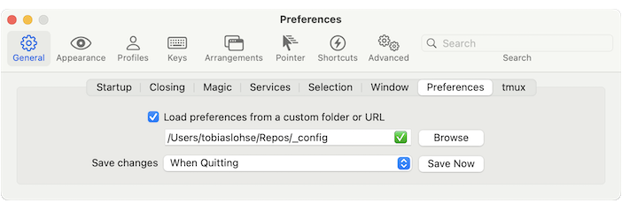
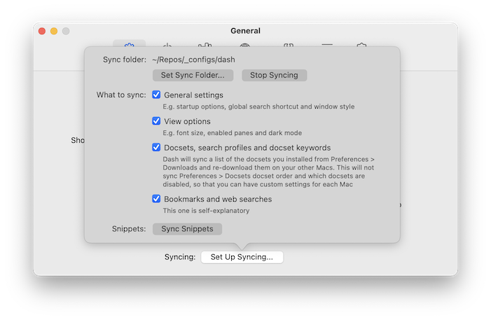

# @MrLoh Mac Config

This Repo contains my system wide configuration files and scripts. It is based on the setup
suggested in [this article][1].

### Usage

1. Install [Homebrew](https://brew.sh)
2. Install Dependencies from [Brewfile](./Brewfile)
	- `brew bundle`
3. Create a Repos folder
	- `mkdir ~/Repos && cd ~/Repos`
4. Clone this repo: 
	- `git clone https://github.com/MrLoh/configs.git`
5. Install [Operator Mono Lig](https://github.com/kiliman/operator-mono-lig) fonts
6. Load iTerm preferences from `~/Repos/_config/`
	
7. Configure [Fish Shell](https://fishshell.com)
	- `./setup.fish.sh`
8. Create symlinks for profiles (!This will overwrite existing profiles)
	- `./link.sh`
9. Setup asdf and install defaults
	- `./setup.asdf.sh`
10. Register R notebook kernel
	- `Rscript ./setup.r`
11. Load Dash preferences from `~/Repos/_configs/dash/`
	

Since the configurations are now symlinked, any further changes can easily be committed to git and
changes from other machines can easily be pulled down via git.

### Content

This contains the following configs:
- gitconfig
- global gitignore
- bashrc
- zshrc
- fishconfig
- fishfunctions
- asdfrc and tool-versions

This helps setup the following tools:
- [iTerm 2](https://iterm2.com)
- [Homebrew](https://brew.sh)
- [Fish Shell](https://fishshell.com)
- [Dash](https://kapeli.com/dash)
- [asdf](https://asdf-vm.com)

It also contains [Übersicht](http://tracesof.net/uebersicht/) desktop widgets.

[1]: https://www.digitalocean.com/community/tutorials/how-to-use-git-to-manage-your-user-configuration-files-on-a-linux-vps#creating-a-configuration-directory-to-store-files