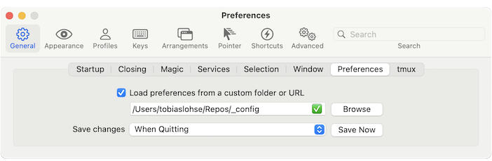
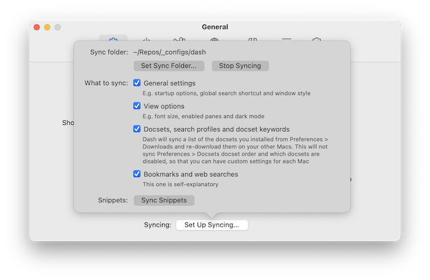

# @MrLoh Mac Config

This Repo contains my system wide configuration files and scripts. It is based on the setup
suggested in [this article][1].

### Usage

1. Install [Homebrew](https://brew.sh)
2. Install Dependencies from [Brewfile](./Brewfile)
	- `brew bundle`
3. Create a Repos folder
	- `mkdir ~/Repos && cd ~/Repos`
4. Clone this repo: 
	- `git clone https://github.com/MrLoh/configs.git`
5. Install [Operator Mono Lig](https://github.com/kiliman/operator-mono-lig) fonts
6. Sign in to your account in [Warp](https://www.warp.dev) (the default terminal). Its built-in
   settings sync (already enabled) restores appearance, keybindings, and shell defaults
   automatically — no config files to symlink.
	- Optionally load iTerm preferences from `~/Repos/_config/` if you still want it around
	
7. Configure [Fish Shell](https://fishshell.com)
	- `./setup.fish.sh`
8. Create symlinks for profiles (!This will overwrite existing profiles)
	- `./link.sh`
9. Setup asdf and install defaults
	- `./setup.asdf.sh`
10. Install Cursor extensions from `cursor/extensions.txt`
	- `./cursor/setup-extensions.sh`
11. Load Dash preferences from `~/Repos/_configs/dash/`
	

Since the configurations are now symlinked, any further changes can easily be committed to git and
changes from other machines can easily be pulled down via git.


### Content

This contains the following configs:
- gitconfig
- global gitignore
- bashrc
- zshrc
- p10k.zsh (powerlevel10k prompt config, primary shell)
- fishconfig
- fishfunctions
- asdf
- cursor (CLI & IDE, including `cursor/extensions.txt` for installed extensions)
- claude
- zed

Warp (the default terminal) is provisioned via the [Brewfile](./Brewfile) cask, but its own
settings (appearance, keybindings, shell default) are not tracked here — they're covered by
Warp's built-in account settings sync instead.

### Secrets

Some generated configs need a real secret that must never be committed. `link.sh` loads an untracked
`.env` file and uses its variables to fill in placeholders in templates.

Create `~/Repos/_configs/.env` with:
```
CONTEXT7_API_KEY=your-key-here
```
Then run `./link.sh`. If `.env` is missing or a variable is unset, the generated file will contain 
an empty placeholder instead.

### Cursor extensions

`cursor/extensions.txt` tracks installed Cursor extensions by ID (one per line, unpinned). Run
`./cursor/setup-extensions.sh` to install everything in the list; it only installs, it never
uninstalls extensions that aren't listed. After installing or removing an extension, run
`./cursor/export-extensions.sh` to refresh the list from your currently installed extensions, then
commit the change.

This helps setup the following tools:
- [iTerm 2](https://iterm2.com)
- [Homebrew](https://brew.sh)
- [Fish Shell](https://fishshell.com)
- [Dash](https://kapeli.com/dash)
- [asdf](https://asdf-vm.com)

[1]: https://www.digitalocean.com/community/tutorials/how-to-use-git-to-manage-your-user-configuration-files-on-a-linux-vps#creating-a-configuration-directory-to-store-files